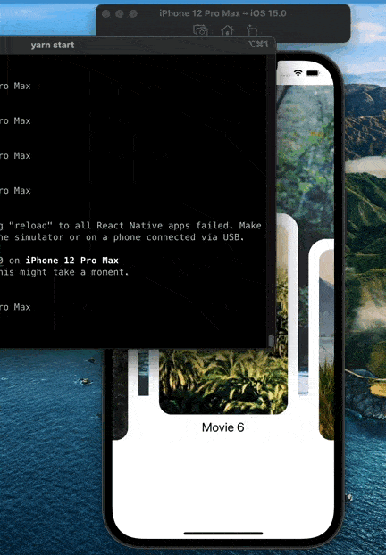

# Carousel APP

## Installation

```sh
npm install 
```

Or

```sh
yarn install 
```

## Start project

```sh
yarn start
```

```sh
npm start
```

> The background image should be equal to the card but both are random generate.


